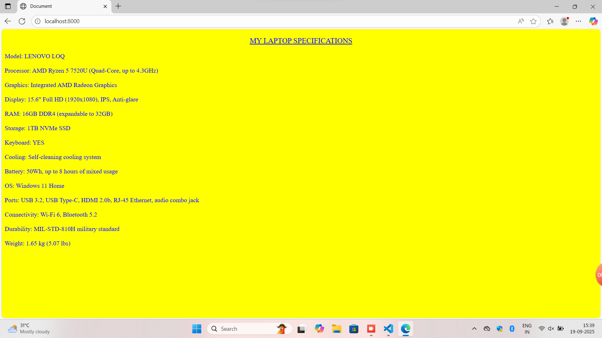
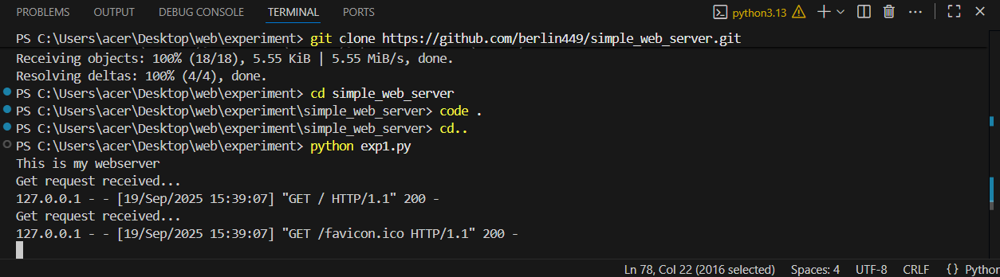

# EX01 Developing a Simple Webserver

# Date:19-09-2025
# AIM:
To develop a simple webserver to serve html pages and display the configuration details of laptop.

# DESIGN STEPS:
## Step 1:
HTML content creation.

## Step 2:
Design of webserver workflow.

## Step 3:
Implementation using Python code.

## Step 4:
Serving the HTML pages.

## Step 5:
Testing the webserver.

# PROGRAM:
```from http.server import BaseHTTPRequestHandler,HTTPServer
content ='''
<!DOCTYPE html>
<html lang="en">
<head>
    <meta charset="UTF-8">
    <meta name="viewport" content="width=device-width, initial-scale=1.0">
    <title>Document</title>
    <style>
        
        *{
            font-family: 'Times New Roman';
        }
            .head{
            text-align: center;
            font-size: larger;
            font-weight: 300;
            text-decoration: underline;
            
        }
    </style>
</head>
<body bgcolor="yellow" text="blue">
    <p class="head">MY LAPTOP SPECIFICATIONS</p>
    <pre>
Model: LENOVO LOQ

Processor: AMD Ryzen 5 7520U (Quad-Core, up to 4.3GHz)

Graphics: Integrated AMD Radeon Graphics

Display: 15.6" Full HD (1920x1080), IPS, Anti-glare
 
RAM: 16GB DDR4 (expandable to 32GB)

Storage: 1TB NVMe SSD

Keyboard: YES

Cooling: Self-cleaning cooling system 

Battery: 50Wh, up to 8 hours of mixed usage

OS: Windows 11 Home

Ports: USB 3.2, USB Type-C, HDMI 2.0b, RJ-45 Ethernet, audio combo jack

Connectivity: Wi-Fi 6, Bluetooth 5.2

Durability: MIL-STD-810H military standard

Weight: 1.65 kg (5.07 lbs)
</pre>
</body>
</html>
'''
class MyServer(BaseHTTPRequestHandler):
    def do_GET(self):
        print("Get request received...")
        self.send_response(200)
        self.send_header("content-type", "text/html")
        self.end_headers()
        self.wfile.write(content.encode())
print("This is my webserver")
server_address =('',8000)
httpd = HTTPServer(server_address,MyServer)
httpd.serve_forever()
class Myserver(BaseHTTPRequestHandler):
    def do_GET(self):
        print("Get request received...")
        self.send_response(200)
        self.send_header("content-type","text/html")
        self.end_headers()
        self.wfile.write(content.encode())
print("This is my webserver")
server_address =('',8000)
httpd = HTTPServer(server_address,Myserver)
httpd.serve_forever()
```
# OUTPUT:


# RESULT:
The program for implementing simple webserver is executed successfully.
